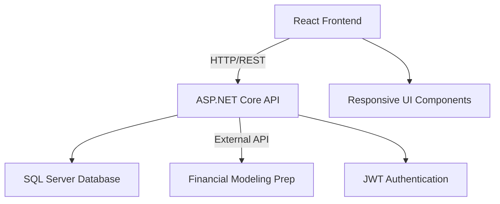

# 🦈 FinShark

> **Your Ultimate Stock Market Companion** - Dive deep into financial data with powerful analytics, portfolio management, and community insights.

[](https://dotnet.microsoft.com/)
[](https://reactjs.org/)
[](https://www.typescriptlang.org/)
[](https://www.microsoft.com/en-us/sql-server)

---

## 🌟 What Makes FinShark Special?

FinShark is a **cutting-edge full-stack financial platform** that transforms how you interact with stock market data. Built with modern technologies and designed for both novice investors and seasoned traders, it offers comprehensive market insights, intelligent portfolio management, and a vibrant community experience.

### ✨ Key Highlights

- 🔍 **Smart Stock Discovery** - Advanced search with real-time market data
- 📊 **Professional Analytics** - Interactive charts, financial statements, and key ratios
- 💼 **Portfolio Mastery** - Intuitive portfolio creation and management
- 💬 **Community Insights** - Share thoughts and learn from other investors
- 🔐 **Bank-Level Security** - JWT authentication with protected user sessions

---

## 🚀 Features That Empower Your Investment Journey

### 🔐 **Secure User Experience**
- Streamlined registration and login process
- JWT-based authentication for maximum security
- Protected routes ensuring data privacy

### 📈 **Comprehensive Stock Analysis**
- **Real-time stock search** with instant results
- **Deep financial insights** including:
  - Balance Sheets & Income Statements
  - Cash Flow Analysis
  - Financial Ratios & Key Metrics  
  - Dividend History & Yield Analysis
- **Interactive data visualization** with professional charts

### 💰 **Smart Portfolio Management**
- Create unlimited custom portfolios
- Add, organize, and track your favorite stocks
- Clean, intuitive portfolio overview
- One-click portfolio management

### 🗣️ **Vibrant Community Features**
- Comment on any stock with your insights
- Engage with fellow investors
- Share analysis and market perspectives
- Build your reputation in the community

### 🎨 **Modern User Interface**
- Clean, professional design language
- Responsive layout for all screen sizes
- Intuitive navigation and user flow
- Loading states and error handling
- Accessible and user-friendly

---

## 🛠️ Technology Stack

### **Frontend Powerhouse**
```
🎯 React 18 + TypeScript    → Type-safe, component-based architecture
🚦 React Router            → Seamless single-page navigation  
🎭 Context API             → Efficient state management
🎨 Tailwind CSS            → Modern, utility-first styling
📡 Axios                   → Robust API communication
🧩 Modular Components      → Reusable, maintainable codebase
```

### **Backend Excellence**
```
⚡ ASP.NET Core 8          → High-performance web API
🗄️ Entity Framework Core   → Modern ORM with migrations
🔑 JWT Authentication      → Secure session management
🏗️ Repository Pattern      → Clean data access abstraction
📋 DTOs & Auto-Mapping     → Structured data transfer
🌐 RESTful API Design      → Industry-standard endpoints
```

### **Data & Infrastructure**
```
🗃️ SQL Server             → Reliable, scalable database
🔄 EF Core Migrations     → Version-controlled schema changes
📊 Financial Modeling Prep → Real-time market data integration
```

---

## 🏗️ System Architecture



**Clean Architecture Benefits:**
- 🔄 **Separation of Concerns** - Frontend, API, and data layers are independent
- 🚀 **Scalability** - Each component can be scaled independently  
- 🛡️ **Security** - Multiple layers of protection
- 🔧 **Maintainability** - Modular design for easy updates

---

## 📁 Project Structure

### Backend (`/api`)
```
📦 api/
├── 🎮 Controllers/     # API endpoints & request handling
├── 🗄️ Data/           # Database context & configuration
├── 📋 DTOs/           # Data transfer objects
├── 🔧 Extensions/     # Helper extensions & utilities
├── 🎯 Helpers/        # Query objects & common functions
├── 🔌 Interface/      # Repository & service contracts
├── 🗺️ Mappers/        # Entity-DTO mapping logic
├── 📊 Migrations/     # Database schema versions
├── 📝 Models/         # Entity models & relationships
├── 🏪 Repository/     # Data access implementations
└── ⚙️ Service/        # Business logic & external APIs
```

### Frontend (`/frontend`)
```
📦 frontend/
├── 🧱 Components/     # Reusable UI building blocks
├── 📄 Pages/          # Route-level page components  
├── 🎭 Context/        # Global state management
├── 📊 Models/         # TypeScript interfaces
├── 🌐 Services/       # API integration layer
├── 🛠️ Helpers/        # Utility functions
└── 🚦 Routes/         # Navigation & route protection
```

---

## 🌐 API Reference

### 🔐 Authentication
| Method | Endpoint | Description |
|--------|----------|-------------|
| `POST` | `/api/account/register` | Create new user account |
| `POST` | `/api/account/login` | Authenticate & receive JWT |

### 📈 Stock Data
| Method | Endpoint | Description |
|--------|----------|-------------|
| `GET` | `/api/stock` | Search & list stocks |
| `GET` | `/api/stock/{id}` | Get detailed stock information |

### 💼 Portfolio Management  
| Method | Endpoint | Description |
|--------|----------|-------------|
| `GET` | `/api/portfolio` | List user's portfolios |
| `POST` | `/api/portfolio` | Create new portfolio |
| `DELETE` | `/api/portfolio/{id}` | Remove portfolio |

### 💬 Community Features
| Method | Endpoint | Description |
|--------|----------|-------------|
| `GET` | `/api/comment/stock/{stockId}` | Get stock comments |
| `POST` | `/api/comment` | Add new comment |
| `PUT` | `/api/comment/{id}` | Update existing comment |
| `DELETE` | `/api/comment/{id}` | Delete comment |

---

## 🚀 Quick Start Guide

### Prerequisites
Make sure you have these installed:
- ✅ **Node.js** (v18 or higher) & npm
- ✅ **.NET 8 SDK**
- ✅ **SQL Server** (LocalDB works fine for development)

### 🏃‍♂️ Launch Backend
```bash
cd api
dotnet restore                    # Install dependencies
dotnet ef database update        # Setup database schema
dotnet run                       # Start the API server 🚀
```
*API will be running at `https://localhost:5001`*

### 🎨 Launch Frontend
```bash
cd frontend  
npm install                      # Install dependencies
npm start                       # Start development server 🎉
```
*App will open at `http://localhost:3000`*

### ⚙️ Configuration
1. **Backend Settings**: Update `api/appsettings.json`
   ```json
   {
     "ConnectionStrings": {
       "DefaultConnection": "your-sql-server-connection"
     },
     "JWT": {
       "Key": "your-secret-key",
       "Issuer": "FinShark"
     },
     "FMPKey": "your-financial-modeling-prep-api-key"
   }
   ```

2. **Environment Variables**: Create `.env` files as needed for sensitive data


## Screenshots


---

